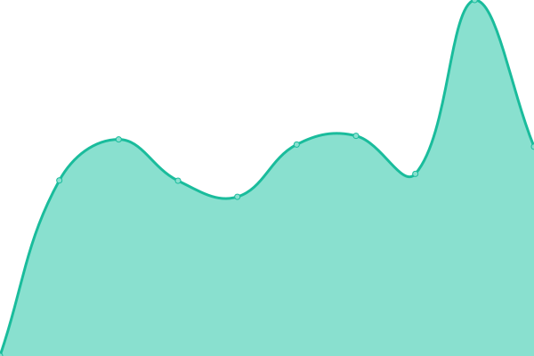

# [📈 Live Status](https://oec-ssu.github.io/status): <!--live status--> **🟧 Partial outage**

This repository contains the open-source uptime monitor and status page for [oec-ssu](https://oec-ssu.github.io/status), powered by [Upptime](https://github.com/upptime/upptime).

With [Upptime](https://upptime.js.org), you can get your own unlimited and free uptime monitor and status page, powered entirely by a GitHub repository. We use [Issues](https://github.com/oec-ssu/status/issues) as incident reports, [Actions](https://github.com/oec-ssu/status/actions) as uptime monitors, and [Pages](https://oec-ssu.github.io/status) for the status page.

<!--start: status pages-->
<!-- This summary is generated by Upptime (https://github.com/upptime/upptime) -->
<!-- Do not edit this manually, your changes will be overwritten -->
<!-- prettier-ignore -->
| URL | Status | History | Response Time | Uptime |
| --- | ------ | ------- | ------------- | ------ |
|  [Ipsilon](https://ipsilon.sgu.ru) | 🟩 Up | [ipsilon.yml](https://github.com/oec-ssu/status/commits/HEAD/history/ipsilon.yml) | 

 1438ms
     
 | 

<a href="https://oec-ssu.github.io/status/history/ipsilon">100.00%</a>
    

|  [Ipsilon-Dev](https://ipsilon-dev.sgu.ru) | 🟥 Down | [ipsilon-dev.yml](https://github.com/oec-ssu/status/commits/HEAD/history/ipsilon-dev.yml) | 

 2704ms
     
 | 

<a href="https://oec-ssu.github.io/status/history/ipsilon-dev">84.11%</a>
    

|  [oec-static.sgu.ru](https://oec-static.sgu.ru/favicon.ico) | 🟩 Up | [oec-static-sgu-ru.yml](https://github.com/oec-ssu/status/commits/HEAD/history/oec-static-sgu-ru.yml) | 

 909ms
     
 | 

<a href="https://oec-ssu.github.io/status/history/oec-static-sgu-ru">100.00%</a>
    

<!--end: status pages-->

[**Visit our status website →**](https://oec-ssu.github.io/status)

## 📄 License

- Powered by: [Upptime](https://github.com/upptime/upptime)
- Code: [MIT](./LICENSE) © [oec-ssu](https://oec-ssu.github.io/status)
- Data in the `./history` directory: [Open Database License](https://opendatacommons.org/licenses/odbl/1-0/)
